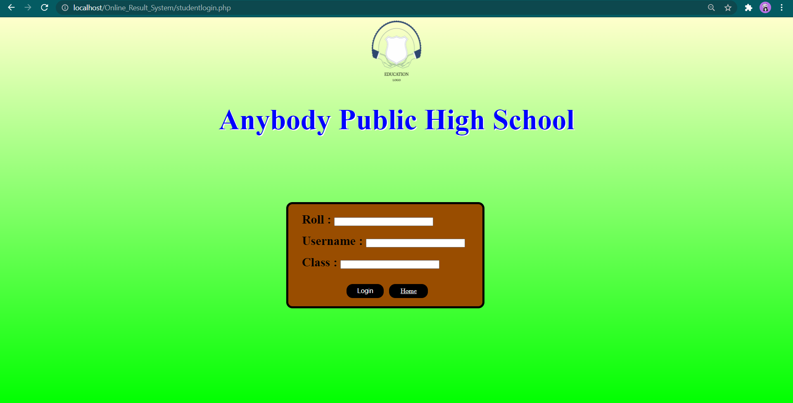
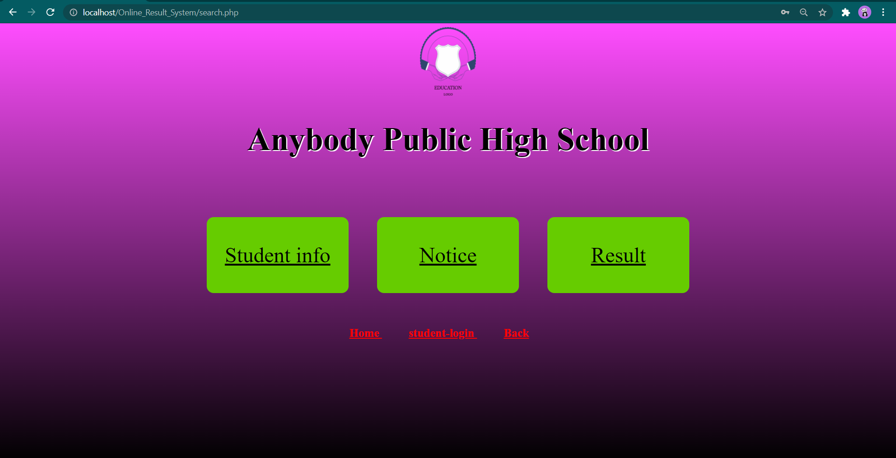

# Online Result System
Online Result System using PHP & MySQL
It is used to check annual result in online.

Video link : https://bit.ly/3pEn2wx

# How to use
<ul>
  <li> Start Apache & MySQL Server </li>
  <li> Clone the git copy in htdocs directory </li>
  <li> Create a database "test" in MySQL Database </li>
  <li> Recover the table "umarks.sql" on "test" database </li>
  <li> Execute <b> "index.php > search.php > result.php" </b> </li>
 </ul>
  
# Marks uploading page (index.php)

# Marks uploading page (adminlogin.php)

# Marks uploading page (admin_edit.php)

# Marks uploading page (student_marks.php)

# Marks uploading page (admin_notice.php)

# Marks uploading page (studentlogin.php)

# Marks uploading page (search.php)

# Marks uploading page (info.php)

# Marks uploading page (notice.php)

# Marks uploading page (result.php)

<strong> 
 Project Develped By : Soujatya Bhattacharya,Abhijit Mondal 
 </strong>

